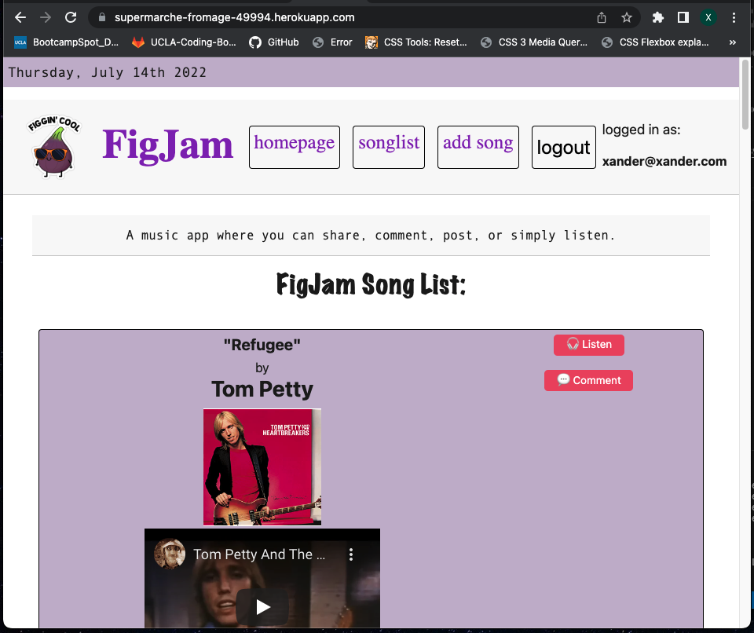
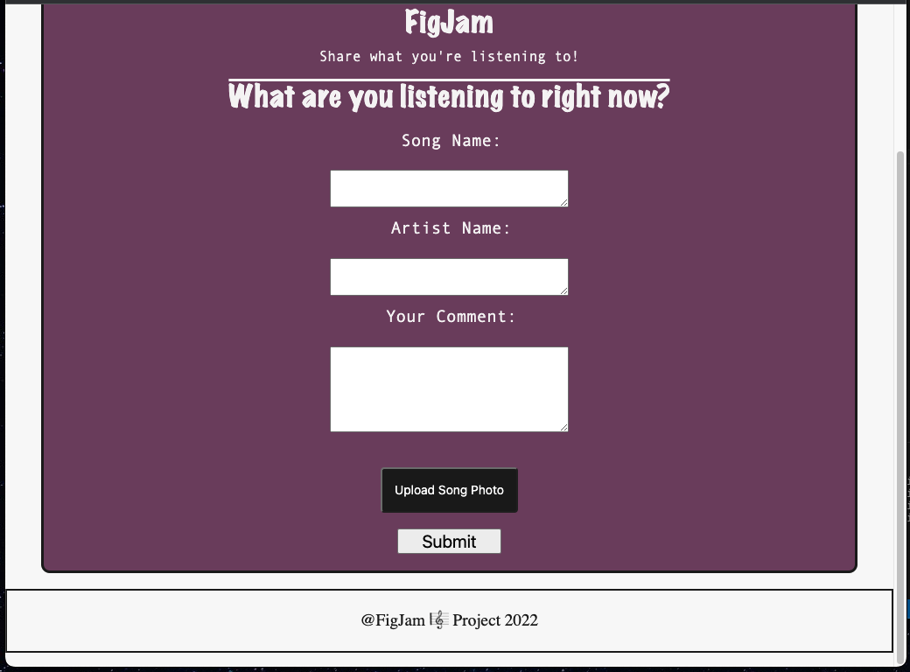

<h1>FigJam</h1>

 
<h1>Project Description</h1>

FigJam is an app that enables users to engage in 
everything music such as posting favorite songs, making 
comments on different topics, or simply listening.
In addition, FigJam also has a video playlist of songs to 
choose from so users can enjoy the audio-visual

 
<h1>Technologies</h1>

Javascript, Handlebars, CSS, Node, Express, Sequelize

  
<h1>Links</h1>
repo: https://github.com/xnd0/FigJam
 
deployed application: https://supermarche-fromage-49994.herokuapp.com/
  

## Screenshots:

